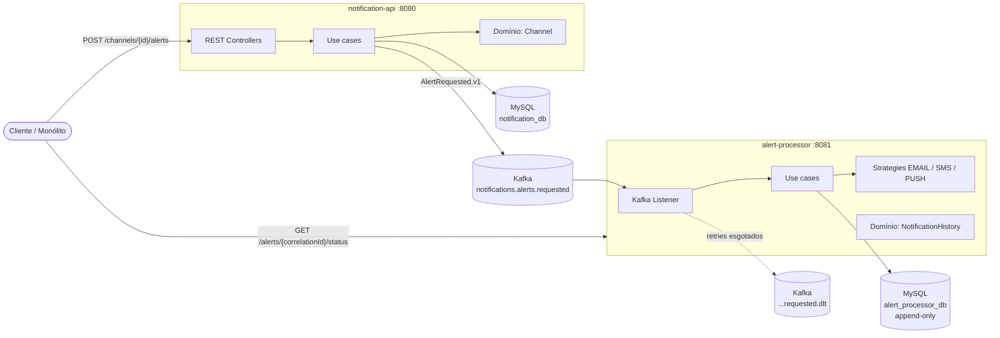
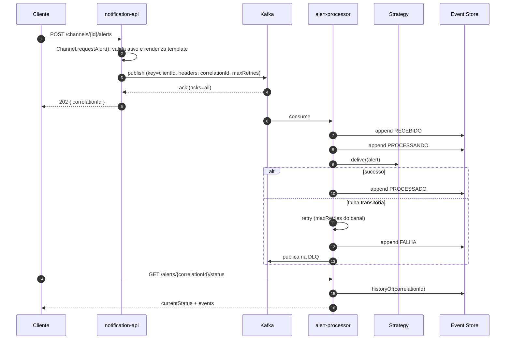

# Arquitetura

## Visão de contexto



## Fluxo de disparo



## Camadas (ambos os serviços)

```
br.com.ubisafe.<serviço>
├── domain            Java puro: agregados, VOs, eventos, repositórios (interfaces)
├── application       Java puro: use cases, commands, views, portas de saída
├── infrastructure    Spring/JPA/Kafka: adaptadores e wiring dos use cases
└── presentation      Spring MVC: controllers, DTOs, erros, filtros, OpenAPI
```

Regra de dependência: `presentation` e `infrastructure` → `application` → `domain`. Garantida por `ArchitectureTest` (ArchUnit).

Dentro de cada camada, o código é agrupado por feature (`channel`, `alert`, `notification`) e, dentro da feature, por tipo de classe. Assim, a pasta já diz qual é a responsabilidade do arquivo.

A regra para decidir: separa em subpastas o que é independente; junta em um pacote só o que colabora internamente. Em Java, o pacote é a menor unidade de visibilidade, então classes que só existem para servir umas às outras (entidade JPA, mapper, adaptador, mensagem Kafka) ficam juntas e package-private. De fora do pacote só aparece a porta do domínio ou da aplicação que elas implementam.

| Subpasta | Conteúdo |
|----------|----------|
| `model` | Agregados, entidades e value objects |
| `event` | Eventos de domínio |
| `exception` | Exceções da camada/feature |
| `repository` | Interfaces (domínio) ou adaptadores (infraestrutura) de persistência |
| `service` | Serviços de domínio/aplicação que não são use cases |
| `usecase` | Um use case por classe |
| `command` / `query` | Entradas dos use cases |
| `dto` | Saídas dos use cases |
| `controller` / `request` / `response` | HTTP: controllers + interface OpenAPI, payloads de entrada e saída |
| `infrastructure/persistence`, `messaging`, `delivery` | Pastas únicas, sem subpastas: adaptadores e seus detalhes internos, todos package-private |

### notification-api

```
br.com.ubisafe.notification
├── domain
│   ├── channel
│   │   ├── model          Channel, ChannelDefinition, ChannelConfig, ChannelId, ChannelType, Priority, Template
│   │   ├── exception      ChannelAlreadyExistsException, ChannelInactiveException, MissingTemplateParametersException
│   │   ├── repository     ChannelRepository
│   │   └── service        ChannelUniquenessPolicy
│   ├── alert
│   │   ├── model          ClientId, CorrelationId
│   │   └── event          AlertRequested
│   └── shared
│       ├── exception      DomainException, DomainValidationException
│       └── pagination     PageQuery, PageResult
├── application
│   ├── channel
│   │   ├── usecase        Create/Get/List/Update/DeleteChannelUseCase
│   │   ├── command        CreateChannelCommand, UpdateChannelCommand, ChannelData
│   │   ├── query          ListChannelsQuery
│   │   ├── dto            ChannelView
│   │   ├── exception      ChannelNotFoundException
│   │   └── service        ChannelLookup
│   ├── alert
│   │   ├── usecase        DispatchAlertUseCase
│   │   ├── command        DispatchAlertCommand
│   │   └── dto            DispatchAlertResult
│   ├── port               AlertPublisher, AlertPublicationException
│   └── shared/exception   ApplicationException
├── infrastructure
│   ├── config             UseCaseConfiguration
│   ├── persistence        JpaChannelRepository, SpringDataChannelRepository, ChannelJpaEntity, ChannelEntityMapper
│   └── messaging          KafkaAlertPublisher, AlertRequestedMessage, AlertHeaders, AlertTopicProperties
└── presentation
    ├── channel
    │   ├── controller     ChannelController, ChannelApi
    │   ├── request        CreateChannelRequest, UpdateChannelRequest, ChannelConfigPayload
    │   └── response       ChannelResponse, ChannelPageResponse
    ├── alert
    │   ├── controller     AlertController, AlertApi
    │   ├── request        DispatchAlertRequest
    │   └── response       AlertAcceptedResponse
    ├── error              GlobalExceptionHandler, ApiProblem, FieldViolation
    └── openapi            OpenApiConfiguration
```

### alert-processor

```
br.com.ubisafe.alertprocessor
├── domain
│   ├── notification
│   │   ├── model          Alert, NotificationHistory, NotificationStatus, ChannelType, CorrelationId, Priority
│   │   ├── event          NotificationEvent
│   │   └── repository     NotificationEventRepository
│   └── shared/exception   DomainException, DomainValidationException
├── application
│   ├── alert
│   │   ├── usecase        ProcessAlertUseCase, RecordAlertFailureUseCase, GetAlertStatusUseCase
│   │   ├── command        ProcessAlertCommand, RecordAlertFailureCommand, AlertData
│   │   ├── dto            AlertStatusView, ProcessingOutcome
│   │   ├── exception      AlertNotFoundException, UnsupportedChannelTypeException
│   │   └── service        DeliveryStrategyResolver
│   ├── port               AlertDeliveryStrategy, DeliveryFailedException
│   └── shared/exception   ApplicationException
├── infrastructure
│   ├── config             UseCaseConfiguration
│   ├── persistence        JpaNotificationEventRepository, SpringDataNotificationEventRepository,
│   │                      NotificationEventJpaEntity, NotificationEventEntityMapper
│   ├── messaging          AlertRequestedListener, AlertRequestedMessage, AlertFailureRecoverer,
│   │                      RetryBackOffPolicy, KafkaConsumerConfiguration, AlertKafkaProperties
│   └── delivery           EmailDeliveryStrategy, SmsDeliveryStrategy, PushDeliveryStrategy,
│                          DeliverySimulator, DeliverySimulationProperties
└── presentation
    ├── alert
    │   ├── controller     AlertStatusController, AlertStatusApi
    │   └── response       AlertStatusResponse
    ├── error              GlobalExceptionHandler, ApiProblem
    └── openapi            OpenApiConfiguration
```

Os testes espelham a mesma estrutura de pacotes da classe testada.

## Decisões

As decisões e seus trade-offs estão registrados em [`docs/adr`](adr/README.md).
